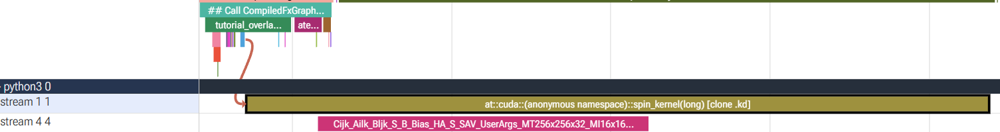
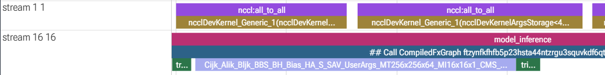
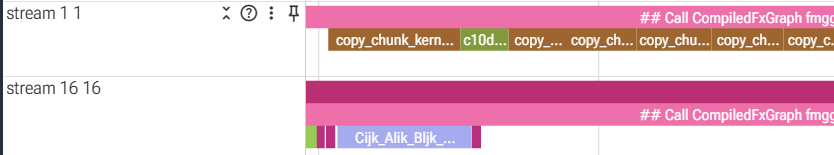

# Making a custom collective overlappable by inductor

This study has the following goal: *Given a custom collective implementation (e.g. one using FlyDSL), how can we make inductor recognize it as a collective that can be overlapped with computation?* In addition to the overlap question we wish to integrate the custom collective in a way that doesn't introduce graph breaks. This study is somehwat of a successor to earlier work on [Iris fused quantized all-to-all](https://github.com/AMD-AGI/diffusion-models-inference-private/pull/793)..

The code samples below have been tested on PyTorch 2.13 ([Dockerfile](https://github.com/AMD-AGI/diffusion-models-inference/blob/arech/current/docker/Dockerfile.ci-this))/gfx950.

## TLDR

We need to expose our collective through `torch.library.custom_op` to get rid of graph breaks. The exact method to make inductor recognize the op as a collective differs based on the scheduler used (old/`torch._inductor.config.reorder_for_compute_comm_overlap = True` vs new/`torch._inductor.config.aten_distributed_optimizations..enable_overlap_scheduling = True`), but conceptually these paths are similar: split the kernel into an asynchronous launch and a wait node that waits for completion of the collective:

```text
Single opaque op, no chance for overlapping:
  - custom_all_to_all(input) -> output -> consumer

Split op, compiler free to move independent compute between launch and wait
  - launch(input) -> pending_output -> wait(pending_output) -> consumer
```

In the legacy scheduler we register explicit lowerings `launch`->`ie._CollectiveKernel` and `wait`->`ir._WaitKernel` via `torch._inductor.lowering.register_lowering`. In the new scheduler the overlapping happens pre-lowering. We take advantage of PyTorch c10d's APIs `torch._C._distributed_c10d._register_work` and the fact that the scheduler recognizes collectives via op names containing a collective name (e.g. `all_to_all`).

**Note**: Both of these paths rely on internal APIs and implementation details so stability across releases should probably not be assumed.

## Standalone example

`minimal_overlap.py` contains a simple standalone example of the overlapping machinery for the new scheduler. In pseudocode the general idea is roughly as below. Runnig the example (`torchrun --standalone --nproc-per-node=1 minimal_overlap.py`) generates a trace that shows the dummy kernel overlapping with the GEMM:



Pseudocode:

```python
# 1. define an asynchronous custom operation
scustom_op("example::all_to_all_launch")
def all_to_all_launch(input, group_name):
    output = allocate_output_like(input)
    with use_stream(communication_stream):
        launch_custom_collective(input, output)
        completion_event = create_event()
        completion_event.record()

    # Connect the custom completion event to c10d wait_tensor.
    def wait_for_completion(timeout):
        completion_event.wait_on_current_stream()
        return True

    # This is the new/fx-scheduler way
    register_work(
        output,
        PythonCallbackWork(wait_for_completion),
    )
    return output

# 2. fake tensor for tracing
@all_to_all_launch.register_fake
def all_to_all_launch_fake(input, group_name):
    return fake_output_like(input)

# 3. async colective semantics via lowering to _CollectiveKernel
@register_lowering(all_to_all_launch)
def lower_all_to_all_launch(input, group_name):
    return CollectiveKernel.create_out_of_place(
        all_to_all_launch,
        input,
        group_name,
    )

# 4. source order now doesn't matter, scheduler free to move the wait around
def model(input, independent_input, group_name):
    pending = all_to_all_launch(input, group_name)
    com. source order now doesn't matter, scheduler free to move the wait around
    independent_result = independent_compute(independent_input)
    return completed, independent_result
```

## xDiT example

`xdit.patch` contains a patch file for an xDiT integration example using a very simple and non-performant FlyDSL all-to-all kernel. Overall the integration is similar to the above minimal example. Note that the kernel implementation itself is completely vibed and should be taken just as a feasibility demonstration, not an actual implementation.

Running the Wan 2.2 model shows the scheduler using the same overlapping opportunities as with RCCL:





## Some notes on the code samples

**_CollectiveKernel/_WaitKernel**: Needed to "inform the compiler" about the volatility of tensors. Assume a sequence like this:

```text
pending = launch(x)
other = independent_compute(a)
ready = wait(pending)
return ready, other
```

Without the registered lowering to `_CollectiveKernel`, `launch(x)` lowers to a fallback kernel node and the compiler might assume it is the last use of x, e.g. freeing x's backing buffer for reuse. However, in reality the collective kernel might still be reading the buffer. The explicit lowering ensures the contract "collective kernel might still be in flight/doing work" stays put until the wait.

**custom_op/register_fake**: Using a `custom_op` solves the graph capture/break issue. Our launch implementation might contain all kinds of non-traceable things, but Dynamo will attempt tracing anyways. As a `custom_op` the operation is opaque and dynamo will not try to trace through the body of the function. `register_fake` is required for modelling the op behavior for tracing using fake tensors, so that no real work has to be executed. `register_fake` is simply the op's input-output contract. Note that this machinery alone is not enough to model the async nature of our custom collectives, hence the explicit lowering mentioned above.
